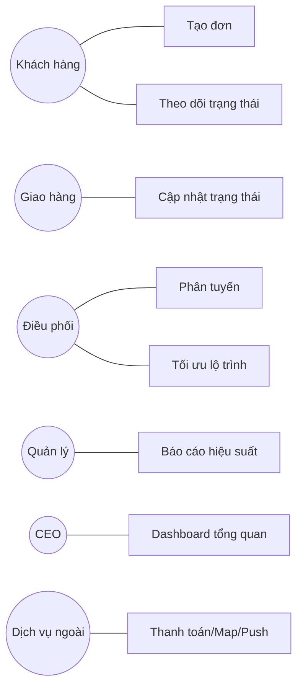
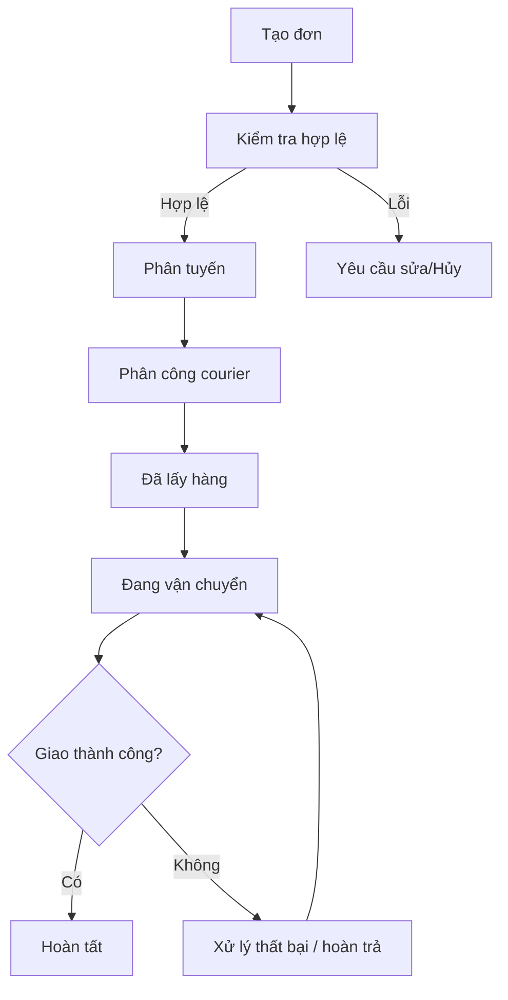
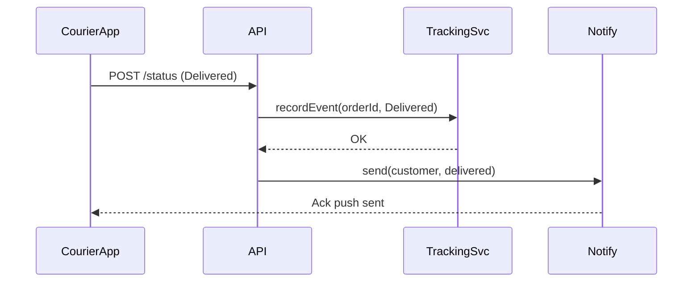
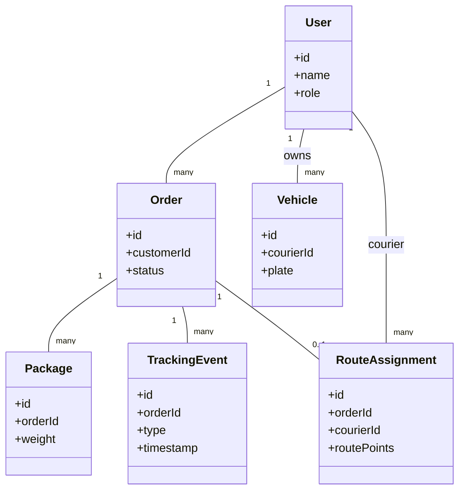

# Phân tích & đề xuất thiết kế hệ thống logistics

## 1. Actors & chức năng

- Khách hàng: Tạo đơn, theo dõi trạng thái, chỉnh địa chỉ, yêu cầu hỗ trợ.
- Nhân viên giao hàng (Courier): Nhận phân công, cập nhật mốc trạng thái (Picked, In-Transit, Delivered/Failed), báo sự cố.
- Điều phối (Dispatcher): Phân tuyến, cân bằng tải, xử lý đơn chậm.
- Quản lý (Manager): Xem báo cáo hiệu suất khu vực, tỷ lệ đúng hạn, danh sách tồn đọng.
- CEO: Dashboard tổng quan (doanh thu, đơn/ngày, vùng hoạt động, KPI).
- Dịch vụ ngoài: Map API, Payment Gateway, Notification Service.

## 2. Phân loại theo hệ thống thông tin

- TPS: Tạo đơn, cập nhật trạng thái, xử lý thanh toán, ghi TrackingEvent.
- MIS: Báo cáo hiệu suất khu vực, tồn đọng, tỷ lệ giao đúng hạn tuần/tháng.
- DSS: Tối ưu tuyến giao, dự báo nhu cầu theo mùa, đề xuất tái phân phối nguồn lực.
- EIS: Dashboard CEO (chỉ số chiến lược, cảnh báo khu vực trễ, xu hướng doanh thu).

## 3. Mô hình phát triển đề xuất

- Chọn: Agile (Scrum + Incremental Microservices).
- Lý do: Nhiều phân hệ có thể triển khai dần (Tracking, Routing, Reporting); yêu cầu thay đổi theo thực tế vận hành; cần feedback nhanh từ khách hàng và đội giao hàng; dễ mở rộng thêm DSS sau khi nền TPS ổn định.

## 4. UML diagrams đề xuất

1. Use Case Diagram: Xác định phạm vi chức năng & tác nhân.
2. Activity Diagram: Luồng vòng đời đơn hàng từ tạo đến kết thúc.
3. Sequence Diagram: Tương tác cập nhật trạng thái giao hàng (Courier app → API → Tracking → Notification).
4. Class Diagram: Mô hình thực thể lõi (User, Order, Package, RouteAssignment, TrackingEvent, Vehicle).

## 5. Use Case (rút gọn)

## 6. Activity (Vòng đời đơn hàng)

## 7. Sequence (Cập nhật trạng thái)

## 8. Class Diagram (lõi)

## 9. Lộ trình triển khai ngắn

- Sprint 1–2: TPS (Order, Status, Tracking).
- Sprint 3–4: MIS (Báo cáo khu vực, tồn đọng).
- Sprint 5: EIS Dashboard + cảnh báo.
- Sprint 6+: DSS tối ưu lộ trình & dự báo.

## 10. Tóm tắt

TPS: Giao dịch & trạng thái đơn. MIS: Báo cáo vận hành. DSS: Tối ưu & dự báo. EIS: Chiến lược cấp cao. Mô hình: Agile đảm bảo linh hoạt và giá trị gia tăng sớm. UML: Use Case, Activity, Sequence, Class hỗ trợ phân tích toàn diện.
