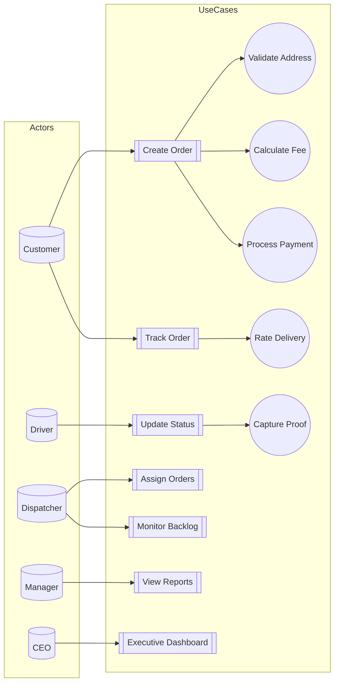
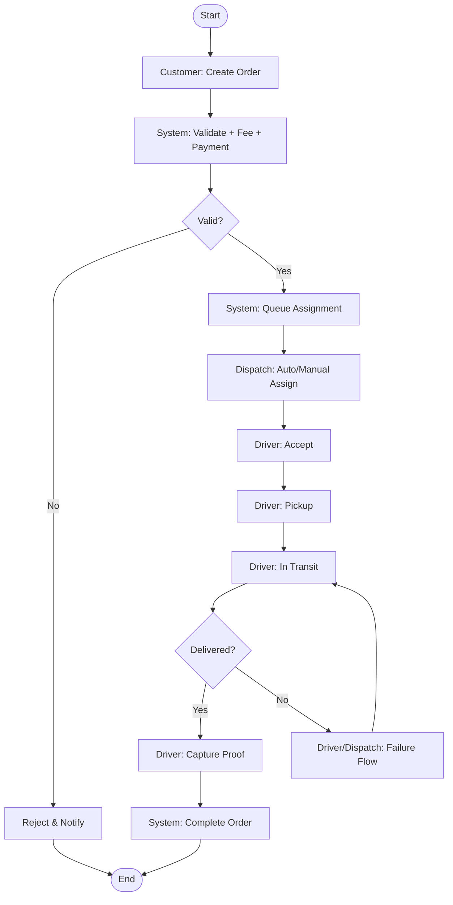
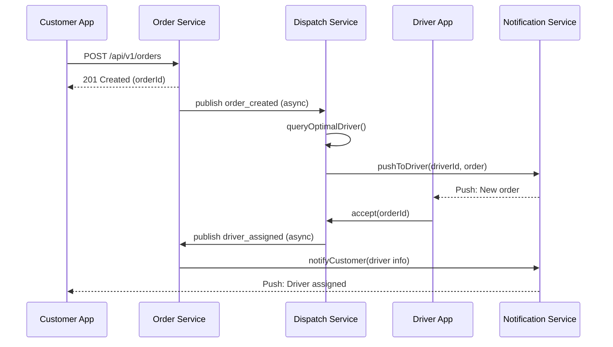
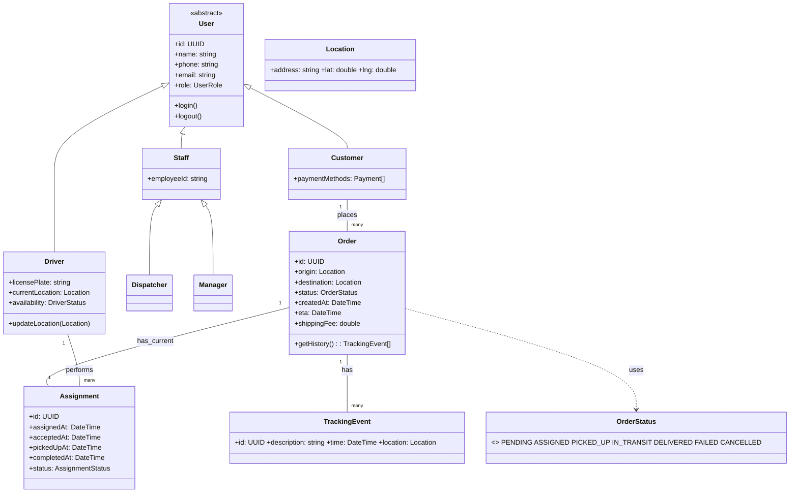
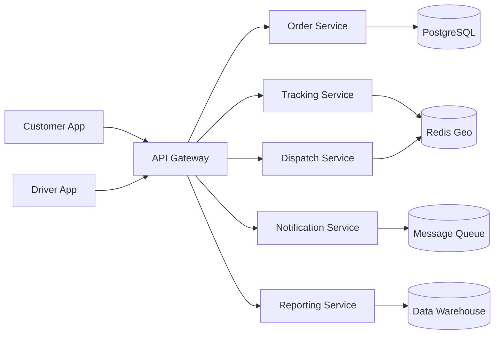

# 🚚 Phân Tích & Thiết Kế Hệ Thống Quản Lý Giao Hàng Logistics (BẢN CHI TIẾT HÓA)

> Chào bạn, đây là bản phân tích chi tiết và chuyên sâu dựa trên yêu cầu. Nội dung mở rộng tập trung vào "vì sao" và "như thế nào" cho từng quyết định thiết kế, kết hợp SDLC, loại hệ thống thông tin, mô hình phát triển và UML.

---

## 1. Bối cảnh & Mục tiêu → Chuyển hóa thành yêu cầu kỹ thuật

| Mục tiêu chiến lược             | Yêu cầu kỹ thuật cụ thể                                                         | Kết quả kỳ vọng                                          |
| ------------------------------- | ------------------------------------------------------------------------------- | -------------------------------------------------------- |
| Tự động hóa quy trình giao hàng | Thuật toán gán tài xế tự động (DSS), hàng đợi sự kiện, xử lý ngoại lệ riêng     | Gi dispatch giảm thao tác thủ công ≥70%                  |
| Nâng cao trải nghiệm khách hàng | Push notification theo mốc trạng thái, ETA động, tracking vị trí thời gian thực | Tỷ lệ hài lòng ≥ 90%, giảm số lần khách hàng gọi hotline |
| Cải thiện hiệu suất vận hành    | Dashboard hiệu suất, phân tích khu vực tồn đọng, KPI tài xế                     | Giảm thời gian giao trung bình, nâng tỷ lệ đúng hạn      |
| Hỗ trợ ra quyết định cấp cao    | EIS với KPI, bản đồ heatmap, xu hướng tuần/tháng                                | CEO có dữ liệu ra quyết định chiến lược                  |

**Diễn giải chi tiết:**

- Thuật toán gán tự động cần dữ liệu vị trí gần-thời-gian-thực (Redis + Tracking Service), tải hiện tại của tài xế, khoảng cách dự báo (GEOGRAPHY/PostGIS) → chuyển Dispatcher sang vai trò giám sát ngoại lệ.
- ETA cập nhật liên tục (cron / event-driven) dựa trên vị trí driver + traffic API (Google Maps / internal) → lưu vào `orders.eta` và phát qua WebSocket.
- KPI tài xế: số đơn/ngày, km/đơn (tính từ geo tuyến), tỷ lệ giao đúng hạn, đánh giá trung bình → lưu lược sử và tổng hợp batch vào Data Warehouse.

---

## 2. Actors & Chức năng chính

| Actor             | Vai trò             | Chức năng chính                                 | Ghi chú                      |
| ----------------- | ------------------- | ----------------------------------------------- | ---------------------------- |
| Customer          | Chủ thể tạo nhu cầu | Create/Cancel Order, Track, Rate Delivery       | Mobile/Web App               |
| Delivery Driver   | Thực thi vận chuyển | View Assigned, Update Status, Share Location    | App + GPS streaming          |
| Dispatcher        | Điều phối ngoại lệ  | Assign override, Monitor backlog, Handle failed | DSS hỗ trợ                   |
| Manager           | Phân tích vận hành  | View performance reports, backlog heatmap       | MIS                          |
| CEO               | Điều hành cấp cao   | Executive dashboard, trend insights             | EIS (tổng hợp cao)           |
| Admin             | Quản trị hệ thống   | User/Role management, config                    | RBAC                         |
| External Services | Cổng tích hợp       | Payment, Maps, SMS/Push                         | API key / secure integration |

---

## 3. Phân loại chức năng theo loại Hệ thống Thông tin (TPS / MIS / DSS / EIS)

| Chức năng              | Loại           | Lý do                                                 |
| ---------------------- | -------------- | ----------------------------------------------------- |
| Create / Cancel Order  | TPS            | Giao dịch đơn lẻ, cần ACID & tính toàn vẹn            |
| Update Status (Driver) | TPS            | Sự kiện cập nhật trạng thái theo thời gian thực       |
| Track Order (Customer) | TPS + MIS nhẹ  | TPS cung cấp dữ liệu; MIS tạo view tổng hợp diễn tiến |
| Assign Orders (Auto)   | DSS (trên TPS) | Tối ưu quyết định: khoảng cách, tải, ETA dự đoán      |
| Monitor Backlog / Map  | MIS            | Tổng hợp dữ liệu theo khu vực & trạng thái            |
| Route Optimization     | DSS            | Mô phỏng & chọn phương án tối ưu (tuyến / phân bổ)    |
| Performance Reports    | MIS            | Báo cáo lịch sử, hiệu suất theo kỳ                    |
| Executive Dashboard    | EIS            | KPI tổng hợp cao + drill-down                         |
| Rate Delivery          | TPS            | Giao dịch phản hồi đơn lẻ                             |

**Giải thích nâng cao:**

- TPS chú trọng tốc độ & độ tin cậy thao tác nhỏ; là nền dữ liệu cho MIS/DSS.
- MIS tái cấu trúc dữ liệu TPS (ETL / CDC) để trả lời câu hỏi "điều gì đã xảy ra".
- DSS bổ sung trí tuệ (thuật toán heuristic / ML) để trả lời "nên làm gì tiếp".
- EIS chắt lọc chỉ số điều hành (OTIF - On Time In Full, Cost-per-delivery, vùng trễ) cho ra quyết định chiến lược.

---

## 4. Mô hình phát triển → Agile (Scrum) + DevOps

| Sprint | Phạm vi chính                         | Giá trị giao ngay             | Phụ thuộc           |
| ------ | ------------------------------------- | ----------------------------- | ------------------- |
| 0      | Kiến trúc, CI/CD, RBAC khung          | Nền tảng build & deploy       | -                   |
| 1      | Core TPS: Order, Status basic         | Hệ thống chạy MVP tối thiểu   | Sprint 0            |
| 2      | Tracking realtime + Customer Track UI | Minh bạch cho khách hàng      | 1                   |
| 3      | MIS báo cáo cơ bản (daily/region)     | Quản lý vận hành có dữ liệu   | 2                   |
| 4      | Auto Assignment (DSS heuristic)       | Gi dispatch giảm tải thủ công | 3                   |
| 5      | EIS dashboard + KPI nâng cao          | CEO insight                   | 3 (dữ liệu lịch sử) |
| 6+     | ML ETA cải tiến, Route optimization   | Nâng cấp DSS                  | 4                   |

**Vì sao không Waterfall?** Nghiệp vụ biến động, yêu cầu tối ưu tuyến học dần từ dữ liệu thực → cần iteration.

**DevOps bổ trợ:**

- CI: build, unit test, lint.
- CD: staging auto deploy + canary prod.
- Observability: logs tập trung, distributed tracing (OpenTelemetry), metrics (Prometheus), alert (Grafana).

---

## 5. Kiến trúc tổng quan (Microservices + Event-driven)

| Service              | Loại         | Trách nhiệm                         | Dữ liệu chính                  |
| -------------------- | ------------ | ----------------------------------- | ------------------------------ |
| Order Service        | TPS          | CRUD đơn hàng, tính phí, trạng thái | orders, tracking_events        |
| Dispatch Service     | DSS          | Gán / tái gán, heuristic / ML route | assignments, driver load cache |
| Driver Service       | TPS          | Hồ sơ tài xế, trạng thái hoạt động  | users(role=driver)             |
| Tracking Service     | TPS (stream) | Ghi nhận vị trí, phát ETA           | tracking_events, Redis geo     |
| Notification Service | Infra        | Push/SMS/email event-based          | queue logs                     |
| Reporting Service    | MIS/EIS      | ETL + tổng hợp, chiều dữ liệu       | fact_delivery, dim_driver      |

**Datastore phân tầng:** OLTP (PostgreSQL), Redis (cache & geo), Data Warehouse (OLAP), Object Storage (POD images).

---

## 6. UML – 4 sơ đồ chính + 1 mở rộng

### 6.1 Use Case (Mô phỏng include / extend)



Ghi chú: Các nút vòng tròn thể hiện hành vi bắt buộc (`include` logic), UC2x & UC3p chỉ kích hoạt ở trạng thái cuối (`extend`).

### 6.2 Activity – Vòng đời đơn hàng (phiên bản rút gọn có logic)



### 6.3 Sequence – Create Order & Assign Driver (chú giải sync/async)



### 6.4 Class – Domain nâng cao với kế thừa & enum



### 6.5 (Mở rộng) Deployment – Triển khai logic



---

## 7. Phân loại chi tiết & Lý giải sâu (TPS/MIS/DSS/EIS)

| Loại | Bản chất                       | Ví dụ                           | Lý giải                          |
| ---- | ------------------------------ | ------------------------------- | -------------------------------- |
| TPS  | Giao dịch nguyên tử, nhất quán | create/update status            | Cần ACID để tránh mất trạng thái |
| MIS  | Tổng hợp lịch sử               | daily SLA report                | Chuyển raw events → metrics      |
| DSS  | Hỗ trợ quyết định              | auto assign, route optimization | Mô hình tính toán "what-if"      |
| EIS  | Tổng quan chiến lược           | CEO dashboard                   | Kết hợp KPI + drill-down         |

Sự phụ thuộc: TPS → MIS (ETL) → DSS (mô hình) → EIS (trình bày quản trị).

---

## 8. SDLC áp dụng (Mapping chi tiết)

| Giai đoạn                | Deliverables                           | Công cụ / Thực hành                          |
| ------------------------ | -------------------------------------- | -------------------------------------------- |
| Planning                 | Charter, Scope, Risk log               | Stakeholder workshop                         |
| Analysis                 | SRS, Use case list, NFR doc            | Story mapping, Event Storming                |
| Design                   | UML, Architecture, Data model          | C4 model, ADR (Architecture Decision Record) |
| Implementation           | Source code, API spec                  | Git branching, Code review, CI pipeline      |
| Testing                  | Unit/Integration/Load/Security reports | Jest/JUnit, k6, OWASP ZAP                    |
| Deployment & Maintenance | Runbook, Monitoring dashboards         | Blue/green, Canary, SLOs                     |

---

## 9. Cơ sở dữ liệu nâng cao & Tối ưu hóa

```sql
-- ENUM đảm bảo toàn vẹn & giảm kích thước lưu trữ
CREATE TYPE user_role AS ENUM ('customer','driver','dispatcher','manager','admin');
CREATE TYPE order_status AS ENUM ('pending','assigned','picked_up','in_transit','delivered','failed','cancelled');

CREATE TABLE users (
	id UUID PRIMARY KEY DEFAULT gen_random_uuid(),
	name TEXT,
	phone TEXT UNIQUE NOT NULL,
	role user_role NOT NULL
);

CREATE TABLE orders (
	id UUID PRIMARY KEY DEFAULT gen_random_uuid(),
	customer_id UUID REFERENCES users(id) NOT NULL,
	origin GEOGRAPHY(Point,4326) NOT NULL,
	destination GEOGRAPHY(Point,4326) NOT NULL,
	created_at TIMESTAMPTZ DEFAULT now(),
	status order_status NOT NULL DEFAULT 'pending',
	shipping_fee NUMERIC(10,2),
	eta TIMESTAMPTZ
);

CREATE TABLE assignments (
	id UUID PRIMARY KEY DEFAULT gen_random_uuid(),
	order_id UUID REFERENCES orders(id) NOT NULL,
	driver_id UUID REFERENCES users(id) NOT NULL,
	assigned_at TIMESTAMPTZ DEFAULT now(),
	accepted_at TIMESTAMPTZ,
	picked_up_at TIMESTAMPTZ,
	completed_at TIMESTAMPTZ,
	status TEXT
);

CREATE TABLE tracking_events (
	id BIGSERIAL PRIMARY KEY,
	order_id UUID REFERENCES orders(id) NOT NULL,
	description TEXT,
	event_time TIMESTAMPTZ DEFAULT now(),
	location GEOGRAPHY(Point,4326)
);

-- Indexes quan trọng
CREATE INDEX idx_orders_customer ON orders(customer_id);
CREATE INDEX idx_orders_status ON orders(status);
CREATE INDEX idx_assignments_driver ON assignments(driver_id);
CREATE INDEX idx_assignments_order ON assignments(order_id);
CREATE INDEX idx_tracking_events_order ON tracking_events(order_id);
CREATE INDEX idx_orders_origin_geo ON orders USING GIST (origin);
CREATE INDEX idx_orders_destination_geo ON orders USING GIST (destination);
```

**Tối ưu:**

- PostGIS cho truy vấn gần (ST_DWithin) → phục vụ DSS gán.
- BIGSERIAL cho bảng sự kiện lớn giúp tuần tự ghi nhanh hơn UUID.
- Enum tránh sai chính tả & cải thiện hiệu năng so sánh.
- Chia partition bảng `tracking_events` theo tháng khi dữ liệu đạt > 50 triệu dòng.

---

## 10. Tóm tắt & Theo dõi mở rộng

| Thành phần | Trạng thái          | Mở rộng tương lai                           |
| ---------- | ------------------- | ------------------------------------------- |
| TPS core   | Hoàn thiện thiết kế | Event sourcing (nếu cần audit đầy đủ)       |
| MIS        | Khung báo cáo       | Thêm SLA alert real-time                    |
| DSS        | Heuristic cơ bản    | ML route optimization, dynamic clustering   |
| EIS        | Dashboard KPI       | Drill-down địa lý nâng cao, predictive KPIs |

**Next steps đề xuất:**

1. Xây bộ đo SLO: latency ghi status < 300ms p95.
2. Thử nghiệm heuristic gán: nearest-driver vs load-balanced vs ETA-min.
3. Triển khai feature flags cho auto-assign để roll-out dần.
4. Thiết lập data lineage cho pipeline ETL (tính minh bạch).

---

> Bản chi tiết đã chuyển đổi đầy đủ sang Markdown, có cấu trúc rõ ràng, hỗ trợ mở rộng. Cho mình biết nếu bạn muốn thêm phần bảo mật, giám sát, hay mô hình dữ liệu sự kiện.
