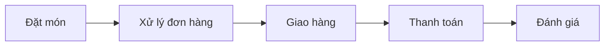

# PHÂN TÍCH 5 THÀNH PHẦN CỦA HỆ THỐNG THÔNG TIN

## 📱 Ví dụ: Hệ thống đặt món ăn online (GrabFood)

---

### 👥 1. CON NGƯỜI (People)

| Vai trò           | Mô tả chi tiết                                  |
| ----------------- | ----------------------------------------------- |
| **👤 Khách hàng** | Người dùng cuối đặt món ăn qua ứng dụng di động |
| **🏪 Nhà hàng**   | Đối tác cung cấp món ăn, nhận và xử lý đơn hàng |
| **🏍️ Tài xế**     | Shipper giao hàng từ nhà hàng đến khách hàng    |
| **⚙️ Admin**      | Nhân viên quản trị hệ thống, xử lý khiếu nại    |
| **💻 IT Support** | Đội ngũ kỹ thuật bảo trì và phát triển hệ thống |

---

### 📊 2. DỮ LIỆU (Data)

| Loại dữ liệu                | Nội dung                                             |
| --------------------------- | ---------------------------------------------------- |
| **👤 Thông tin khách hàng** | Tài khoản, địa chỉ, lịch sử đặt món, sở thích        |
| **🏪 Dữ liệu nhà hàng**     | Menu, giá cả, thời gian mở cửa, đánh giá, hình ảnh   |
| **📋 Thông tin đơn hàng**   | Chi tiết món ăn, số lượng, tổng tiền, thời gian đặt  |
| **🏍️ Dữ liệu tài xế**       | Vị trí GPS, trạng thái, lịch sử giao hàng, đánh giá  |
| **💳 Dữ liệu thanh toán**   | Thông tin giao dịch, phương thức thanh toán, lịch sử |

---

### 🔄 3. QUY TRÌNH (Process)



| Giai đoạn             | Quy trình chi tiết                                    |
| --------------------- | ----------------------------------------------------- |
| **🛒 Đặt món**        | Khách chọn món → Thêm vào giỏ → Xác nhận → Thanh toán |
| **📝 Xử lý đơn hàng** | Nhà hàng nhận đơn → Xác nhận → Chuẩn bị món ăn        |
| **🚚 Giao hàng**      | Tìm tài xế → Nhận món → Di chuyển → Giao cho khách    |
| **💰 Thanh toán**     | Xử lý payment → Chia sẻ doanh thu cho đối tác         |
| **⭐ Đánh giá**       | Khách đánh giá món ăn và chất lượng dịch vụ           |

---

### 💻 4. PHẦN MỀM (Software)

| Ứng dụng                     | Chức năng                                         |
| ---------------------------- | ------------------------------------------------- |
| **📱 Mobile App khách hàng** | Giao diện đặt món, theo dõi đơn hàng, thanh toán  |
| **🏪 App nhà hàng**          | Quản lý menu, nhận đơn hàng, cập nhật trạng thái  |
| **🏍️ App tài xế**            | Nhận đơn giao hàng, định vị GPS, báo cáo thu nhập |
| **🖥️ Web Admin**             | Dashboard quản trị, báo cáo, xử lý khiếu nại      |
| **⚡ API & Database**        | Hệ thống backend xử lý dữ liệu và logic nghiệp vụ |

---

### 🖥️ 5. PHẦN CỨNG (Hardware)

| Thiết bị             | Ứng dụng                                                 |
| -------------------- | -------------------------------------------------------- |
| **📱 Smartphone**    | Thiết bị của khách hàng, nhà hàng, tài xế để sử dụng app |
| **🖥️ Server**        | Máy chủ lưu trữ dữ liệu và xử lý requests từ người dùng  |
| **🌐 Thiết bị mạng** | Router, switch, cáp mạng để đảm bảo kết nối internet     |
| **🖨️ POS nhà hàng**  | Máy in hóa đơn, máy quét mã QR, tablet nhận đơn          |
| **📡 GPS tracker**   | Thiết bị định vị trong điện thoại tài xế để tracking     |

---

## 🔗 Sơ đồ tương tác giữa các thành phần

```
         ┌─────────────────┐
         │   🏛️ HỆ THỐNG    │
         │   GRABFOOD      │
         └─────────┬───────┘
                   │
    ┌──────────────┼──────────────┐
    │              │              │
┌───▼───┐     ┌────▼────┐     ┌───▼───┐
│ 👤👥  │     │ 💻📱⚡  │     │ 🖥️📡  │
│PEOPLE │◄────┤SOFTWARE├────►│HARDWARE│
└───┬───┘     └────┬────┘     └───┬───┘
    │              │              │
    └──────┬───────┼───────┬──────┘
           │       │       │
       ┌───▼───┐   │   ┌───▼───┐
       │ 🔄📋  │   │   │ 📊💾  │
       │PROCESS│◄──┼──►│ DATA  │
       └───────┘   │   └───────┘
                   │
         ┌─────────▼─────────┐
         │  💡 TƯƠNG TÁC      │
         │  & LIÊN KẾT       │
         └───────────────────┘
```

---

## 🎯 Kết luận

> **Tất cả 5 thành phần này phải hoạt động đồng bộ và liên kết chặt chẽ để tạo nên một hệ thống đặt món ăn online hiệu quả. Thiếu bất kỳ thành phần nào, hệ thống sẽ không thể vận hành được một cách trọn vẹn.**

### ✨ Yếu tố thành công:

- **Tích hợp seamless** giữa các thành phần
- **User experience** mượt mà và trực quan
- **Hiệu suất** xử lý cao và ổn định
- **Bảo mật** dữ liệu và giao dịch
- **Khả năng mở rộng** theo nhu cầu thị trường
