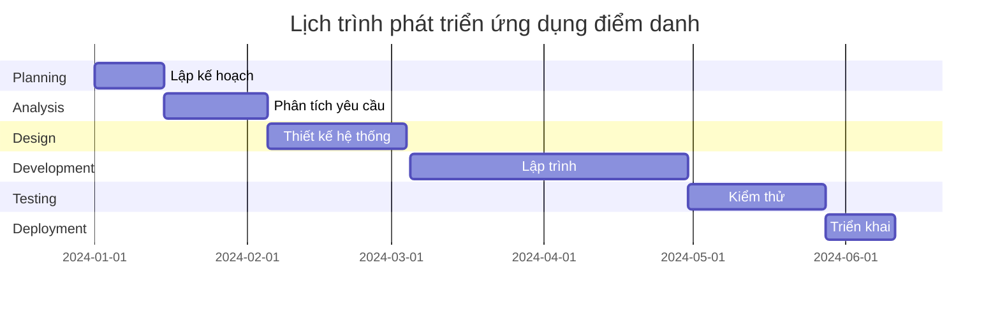

# 🎓 PHÂN TÍCH 6 GIAI ĐOẠN SDLC CHO ỨNG DỤNG ĐIỂM DANH SINH VIÊN

## 📋 Tổng quan dự án

**Ứng dụng**: Hệ thống điểm danh sinh viên thông minh cho trường học  
**Mục tiêu**: Tự động hóa quy trình điểm danh, nâng cao hiệu quả quản lý học tập

---

## 🔄 Phân tích chi tiết 6 giai đoạn SDLC

### 1. 📅 **PLANNING** - Lập kế hoạch

**🎯 Mục tiêu chính:**

- Tự động hóa quá trình điểm danh, giảm 80% thời gian
- Xây dựng hệ thống quản lý hiện đại cho nhà trường

**👥 Stakeholders:**

- **Giáo viên**: Người sử dụng chính, quản lý điểm danh
- **Sinh viên**: Đối tượng được điểm danh
- **Phòng đào tạo**: Quản lý dữ liệu, báo cáo

**⏱️ Timeline:** 2 tuần
**💰 Ngân sách:** Chi phí nhân sự, thiết bị, hosting cloud
**⚠️ Rủi ro:** Bảo mật dữ liệu, tích hợp hệ thống hiện tại

---

### 2. 🔍 **ANALYSIS** - Phân tích yêu cầu

**📝 Thu thập yêu cầu:**

| Đối tượng      | Yêu cầu chính                                                                  |
| -------------- | ------------------------------------------------------------------------------ |
| **Giáo viên**  | • Điểm danh nhanh chóng<br>• Xuất báo cáo tự động<br>• Theo dõi tỷ lệ vắng mặt |
| **Sinh viên**  | • Điểm danh dễ dàng<br>• Xem lịch sử điểm danh<br>• Thông báo lịch học         |
| **Nhà trường** | • Quản lý tập trung<br>• Báo cáo thống kê<br>• Tích hợp hệ thống               |

**⚙️ Chức năng chính:**

- ✅ Quét mã QR để điểm danh
- 📍 Xác thực vị trí GPS
- 👤 Nhận diện khuôn mặt (tùy chọn)
- 📊 Dashboard thống kê

**📋 Yêu cầu phi chức năng:**

- 🔒 Bảo mật cao
- ⚡ Hiệu suất tốt (≤3s response time)
- 📱 Giao diện thân thiện

---

### 3. 🎨 **DESIGN** - Thiết kế hệ thống

**🏗️ Kiến trúc tổng thể:**

```
📱 Mobile App ←→ 🌐 API Gateway ←→ 🖥️ Backend Services ←→ 🗄️ Database
                                        ↓
                                   📊 Admin Panel
```

**💾 Thiết kế Database:**

- **Users**: Thông tin giáo viên, sinh viên
- **Classes**: Lớp học, môn học
- **Attendance**: Dữ liệu điểm danh
- **Reports**: Báo cáo thống kê

**🎯 Công nghệ stack:**

- **Frontend**: React Native (Mobile), React.js (Admin)
- **Backend**: Node.js + Express
- **Database**: MongoDB
- **Cloud**: AWS/Google Cloud

---

### 4. ⚙️ **IMPLEMENTATION** - Triển khai phát triển

**📱 Mobile Application:**

- Giao diện điểm danh sinh viên
- Tính năng quét QR code
- GPS tracking và validation
- Push notifications

**🖥️ Web Admin Panel:**

- Dashboard quản lý lớp học
- Tạo mã QR cho từng buổi học
- Xuất báo cáo điểm danh
- Quản lý người dùng

**🔧 Backend Services:**

- RESTful API
- Authentication & Authorization
- Real-time data processing
- Automated reporting

---

### 5. 🧪 **TESTING** - Kiểm thử toàn diện

**🔬 Các loại test:**

| Loại test        | Mục đích               | Tiêu chí pass        |
| ---------------- | ---------------------- | -------------------- |
| **Unit Testing** | Test từng component    | Coverage ≥ 80%       |
| **Integration**  | Test kết nối API       | All endpoints work   |
| **Performance**  | Tốc độ xử lý           | Response time ≤ 3s   |
| **Security**     | Bảo mật dữ liệu        | Zero vulnerabilities |
| **UAT**          | Trải nghiệm người dùng | Satisfaction ≥ 85%   |

**📋 Test scenarios:**

- Điểm danh đồng thời nhiều sinh viên
- Xử lý khi mất kết nối internet
- Bảo mật khi truy cập trái phép

---

### 6. 🚀 **DEPLOYMENT & MAINTENANCE** - Triển khai & Vận hành

**📦 Deployment Pipeline:**

```
Development → Staging → Production
     ↓           ↓          ↓
   Git Push → Auto Test → Manual Deploy
```

**🎯 Go-live Activities:**

- Deploy ứng dụng lên App Store/Google Play
- Setup production server với high availability
- Training cho 100% giáo viên và sinh viên
- 24/7 monitoring và support

**🔄 Maintenance Plan:**

- Weekly health checks
- Monthly feature updates
- Quarterly security audits
- Annual system upgrades

---

## 📅 Timeline tổng thể



---

## 📊 Sản phẩm đầu ra (Deliverables)

| 🎯 Giai đoạn       | 📋 Deliverables                                                  | 👤 Người chịu trách nhiệm |
| ------------------ | ---------------------------------------------------------------- | ------------------------- |
| **Planning**       | • Project Charter<br>• Resource Plan<br>• Risk Matrix            | Project Manager           |
| **Analysis**       | • SRS Document<br>• Use Case Diagrams<br>• User Stories          | Business Analyst          |
| **Design**         | • System Architecture<br>• Database Schema<br>• UI/UX Prototypes | Solution Architect        |
| **Implementation** | • Source Code<br>• API Documentation<br>• Mobile & Web Apps      | Development Team          |
| **Testing**        | • Test Reports<br>• Bug Tracking<br>• UAT Sign-off               | QA Team                   |
| **Deployment**     | • Live Application<br>• User Manuals<br>• Support Docs           | DevOps Team               |

---

## 🎯 Tiêu chí thành công

### 📈 KPIs chính

| Metric                     | Target         | Measurement                   |
| -------------------------- | -------------- | ----------------------------- |
| **⏱️ Thời gian điểm danh** | Giảm 80%       | So với phương pháp thủ công   |
| **🎯 Độ chính xác**        | ≥ 99%          | Ghi nhận điểm danh đúng       |
| **😊 User Satisfaction**   | ≥ 85%          | Survey sau 3 tháng sử dụng    |
| **🔒 Security**            | Zero incidents | Trong 6 tháng đầu             |
| **📱 App Performance**     | ≤ 3s response  | Thời gian phản hồi trung bình |

### 🏆 Success Criteria

- ✅ 100% lớp học áp dụng thành công
- ✅ 95% giáo viên hài lòng với hệ thống
- ✅ 90% sinh viên sử dụng thường xuyên
- ✅ ROI đạt 150% sau 1 năm vận hành

---

_📝 Tài liệu này sẽ được cập nhật định kỳ theo tiến độ dự án_
