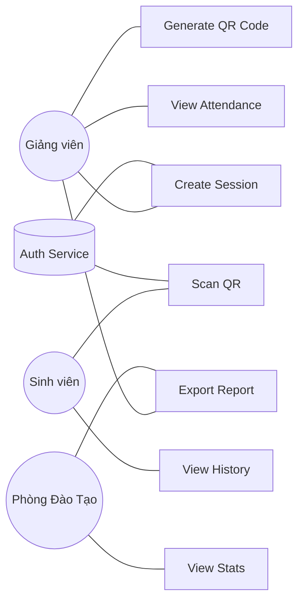
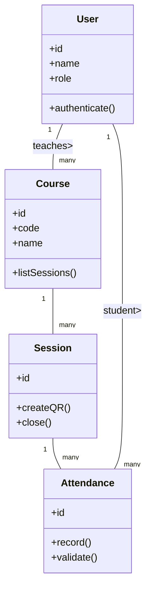
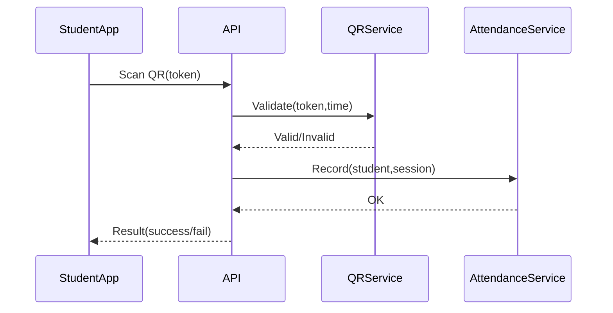
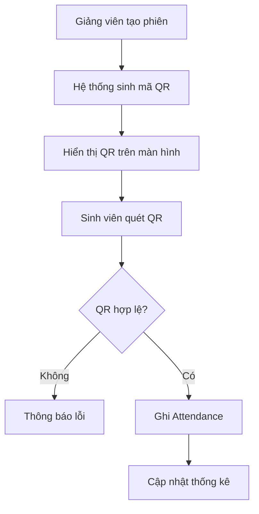

# SDLC 3 GIAI ĐOẠN ĐẦU – HỆ THỐNG ĐIỂM DANH QR CODE

## 1. PLANNING (Lập kế hoạch)

- Mục tiêu: Tự động hóa điểm danh; giảm thời gian thao tác ≥70%; cung cấp báo cáo cho phòng đào tạo.
- Phạm vi: App sinh viên (quét QR), Portal giảng viên (tạo buổi học + mã QR), Portal phòng đào tạo (thống kê).
- Stakeholders: Giảng viên, Sinh viên, Phòng đào tạo, IT Admin.
- Giả định: Mỗi sinh viên có smartphone; hạ tầng mạng ổn định; mã QR có hiệu lực phiên học.
- Rủi ro chính: Gian lận điểm danh (chụp/forward QR), lỗi kết nối mạng, bảo mật dữ liệu cá nhân.
- Giảm thiểu rủi ro: Thêm xác thực vị trí / thời gian; token hết hạn; mã hóa truyền dữ liệu.
- Timeline (cao cấp): 2w Planning + Analysis, 2w Design, 6w Development (MVP), 3w Testing, 1w Deploy.

## 2. REQUIREMENT ANALYSIS (Phân tích yêu cầu)

### 2.1 Functional Requirements

- Giảng viên: Tạo buổi học, sinh mã QR động, xem danh sách điểm danh, xuất báo cáo.
- Sinh viên: Đăng nhập, quét QR, xem lịch sử điểm danh.
- Phòng đào tạo: Xem thống kê theo lớp/môn/kỳ, xuất tổng hợp.
- Hệ thống: Tự động hết hạn mã QR sau X phút; chống quét lặp; ghi log truy cập.

### 2.2 Non-functional

- Bảo mật: JWT + HTTPS, phân quyền theo vai trò.
- Hiệu năng: Xử lý quét < 2s; chịu tải đồng thời ≥ 500 lượt quét/5 phút.
- Khả dụng: Uptime ≥ 99%.
- Khả năng mở rộng: Module nhận diện khuôn mặt có thể thêm sau.

### 2.3 Use Cases (UML lựa chọn: Use Case Diagram cho chức năng)

- Actors: Lecturer, Student, TrainingDept, AuthService
- Use Cases: CreateSession, GenerateQRCode, ScanQRCode, RecordAttendance, ViewStats, ExportReport, ViewHistory.

### 2.4 UML – Use Case Diagram

## 3. SYSTEM DESIGN (Thiết kế hệ thống)

### 3.1 Lựa chọn UML

- Luồng chức năng: Use Case Diagram (đã có).
- Luồng xử lý quét: Sequence Diagram.
- Quy trình điểm danh: Activity Diagram.
- Cấu trúc dữ liệu đối tượng: Class Diagram.

### 3.2 Kiến trúc tổng quan

Client (Mobile App Student + Web Portal Lecturer/Training) → API Gateway → Attendance Service / QR Service / Reporting Service → Database (Relational + Cache).

### 3.3 Core Data Model (bảng / lớp)

- User(id, name, role, email, status)
- Course(id, code, name, lecturerId)
- Session(id, courseId, startTime, endTime, qrSeed, status)
- Attendance(id, sessionId, studentId, scanTime, location, method)
- Report(materialized/statistical view)

### 3.4 Class Diagram (rút gọn)

### 3.5 Sequence Diagram (Quét mã QR)

### 3.6 Activity Diagram (Tạo & điểm danh phiên học)

### 3.7 Thiết kế bảo mật

- RBAC: Roles = Lecturer, Student, TrainingDept, Admin.
- JWT + Refresh Token.
- QR token = hash(SessionId + timestamp + secret), TTL ngắn (≤60s).

### 3.8 Ràng buộc & Quy tắc

- Một sinh viên chỉ điểm danh 1 lần / phiên.
- Phiên chỉ ở trạng thái OPEN trong khoảng thời gian hợp lệ.
- Báo cáo tích hợp dữ liệu Attendance + Session.

## Tóm tắt UML chọn

- Use Case: Xác định phạm vi chức năng.
- Class Diagram: Cấu trúc thực thể cốt lõi.
- Sequence: Tương tác theo thời gian (quét).
- Activity: Dòng công việc tạo & thực hiện điểm danh.

_Đã hoàn thành 3 giai đoạn đầu: Planning, Requirement Analysis, System Design._
