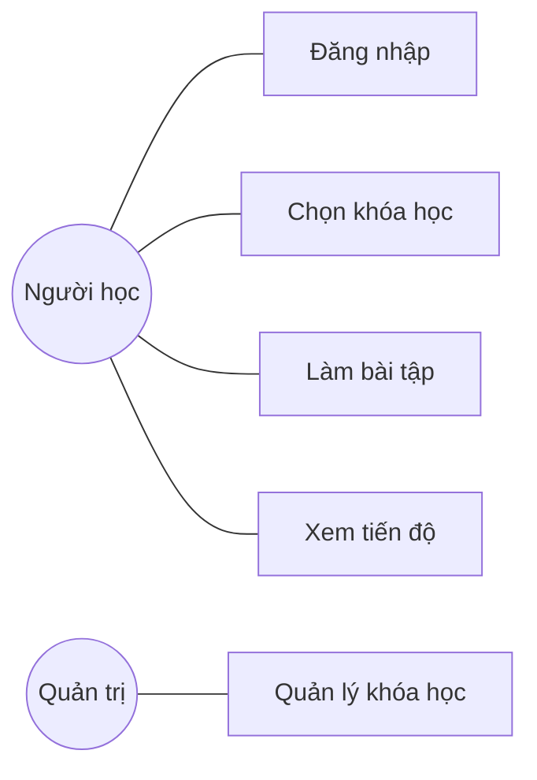
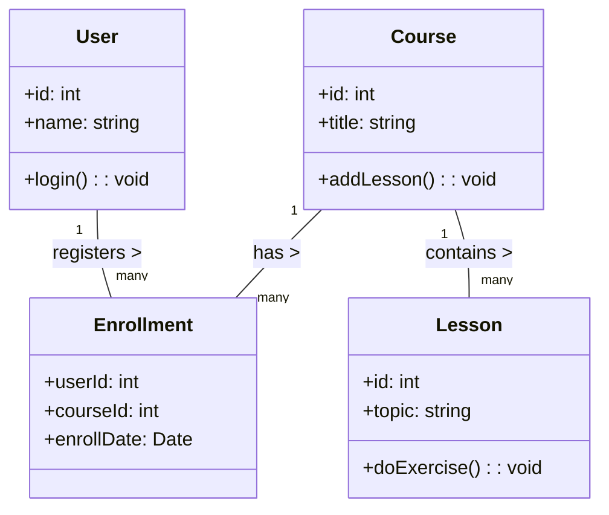
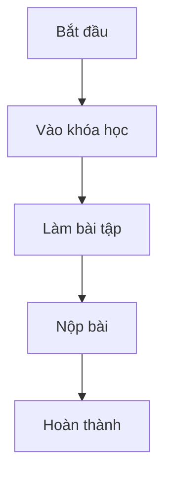
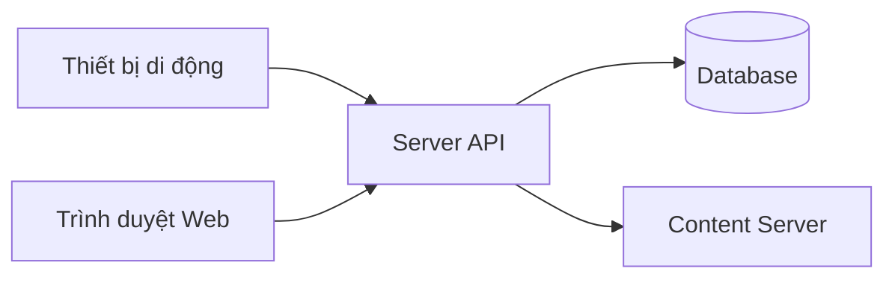
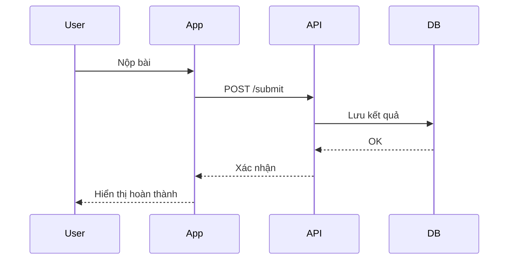

# Chọn sơ đồ UML phù hợp

| Tình huống                                                  | Sơ đồ UML          | Giải thích ngắn                      |
| ----------------------------------------------------------- | ------------------ | ------------------------------------ |
| A. Mô tả chức năng người dùng trên ứng dụng học tiếng Anh   | Use Case Diagram   | Chỉ ra các tác nhân và chức năng     |
| B. Mô tả lớp NguoiDung, KhoaHoc, BaiHoc và quan hệ          | Class Diagram      | Biểu diễn lớp, thuộc tính, quan hệ   |
| C. Luồng học viên: bắt đầu → vào học → làm bài → hoàn thành | Activity Diagram   | Mô tả quy trình công việc tuần tự    |
| D. Cách hệ thống triển khai trên máy chủ, thiết bị          | Deployment Diagram | Phân bố các nút (nodes) và artifacts |
| E. Thứ tự tương tác khi học viên nộp bài                    | Sequence Diagram   | Trình tự thông điệp giữa đối tượng   |

## Ví dụ minh họa (rút gọn)

### A. Use Case (Ứng dụng học tiếng Anh)

### B. Class Diagram

### C. Activity Diagram

### D. Deployment Diagram (khái quát)

### E. Sequence Diagram (Nộp bài)

