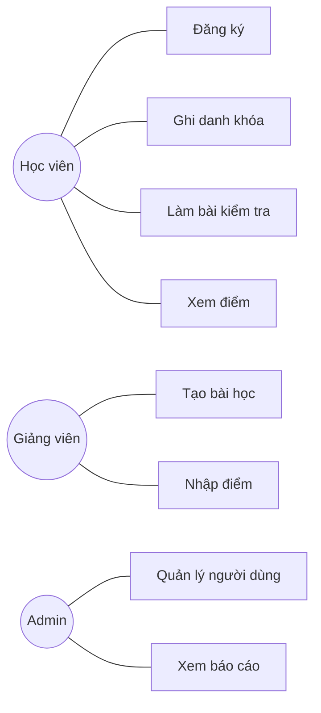
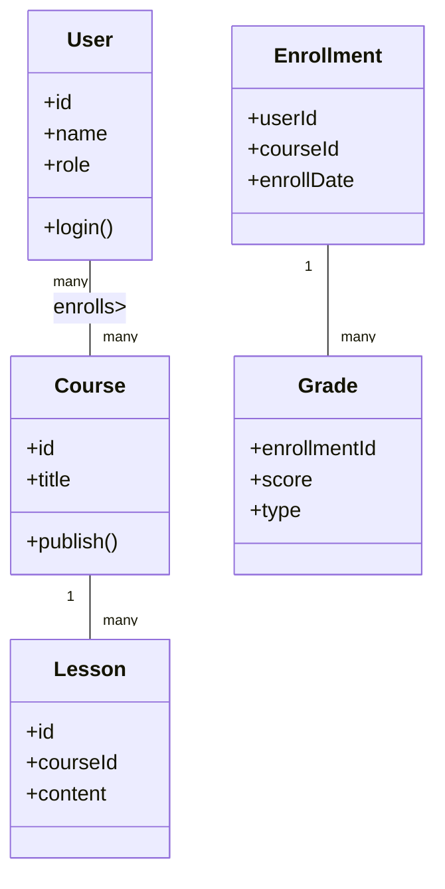
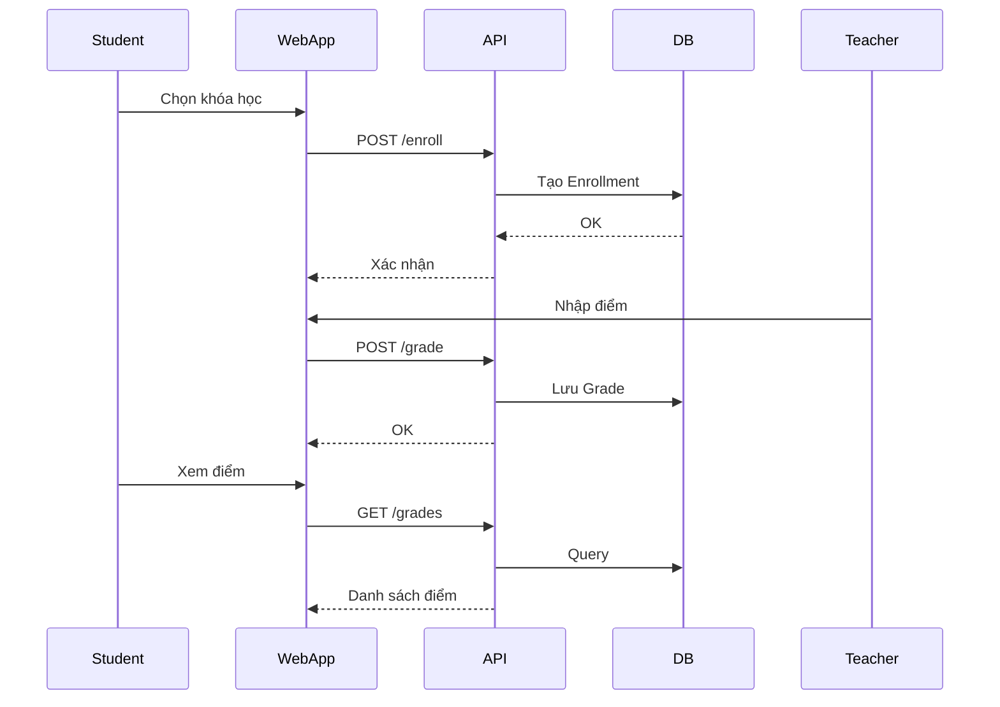

# Phân tích nền tảng học trực tuyến trung tâm ngoại ngữ

## 1. Tác nhân và chức năng

- Học viên: Đăng ký tài khoản, ghi danh khóa học, học bài, làm bài kiểm tra, xem điểm.
- Giảng viên: Tạo/chỉnh sửa bài học, nhập điểm, quản lý bài tập, xem tiến độ lớp.
- Admin: Quản lý người dùng/ phân quyền, tạo khóa học, xem báo cáo, cấu hình hệ thống.

## 2. Phân loại hệ thống thông tin

- Ghi danh khóa học, nhập điểm: TPS (Transaction Processing System).
- Báo cáo tiến độ lớp, tổng hợp điểm: MIS (Management Information System).
- Dashboard thống kê cho Admin (tổng doanh thu, tỷ lệ hoàn thành): EIS (Executive Information System).
- Gợi ý khóa học theo kết quả học (nếu mở rộng): DSS (Decision Support System).

## 3. Mô hình phát triển phần mềm đề xuất

- Chọn: Agile (Iterative + Scrum).
- Lý do: Yêu cầu dễ thay đổi (nâng cấp nội dung học, trải nghiệm người dùng), cần phản hồi nhanh từ học viên/giảng viên, có thể phát hành tính năng nhỏ (quản lý điểm, forum, live class) theo sprint, giảm rủi ro sai hướng.

## 4. 3 sơ đồ UML sử dụng

- Use Case Diagram: Xác định tác nhân và chức năng chính.
- Class Diagram: Mô hình thực thể (User, Course, Lesson, Enrollment, Grade).
- Sequence Diagram (hoặc Activity Diagram): Luồng ghi danh và chấm điểm.

## 5. Use Case (rút gọn)

## 6. Class Diagram (rút gọn)

## 7. Sequence (ghi danh + chấm điểm)

