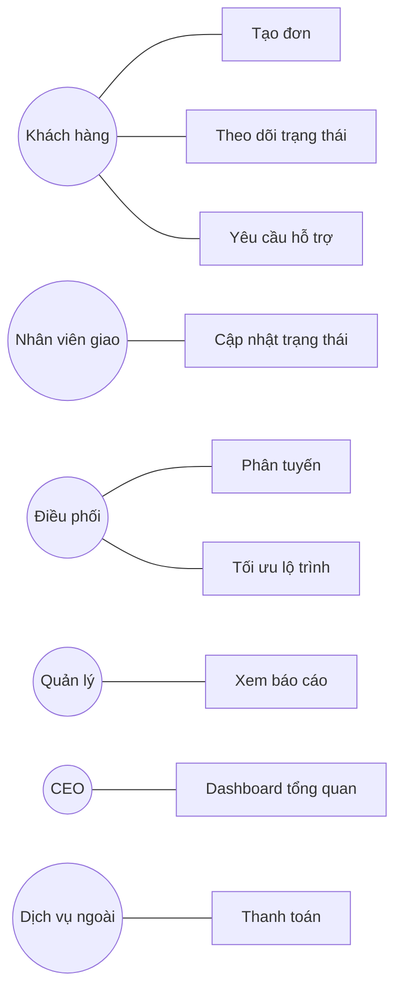
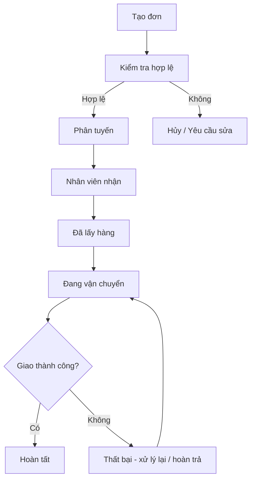
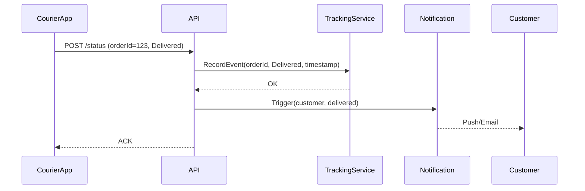
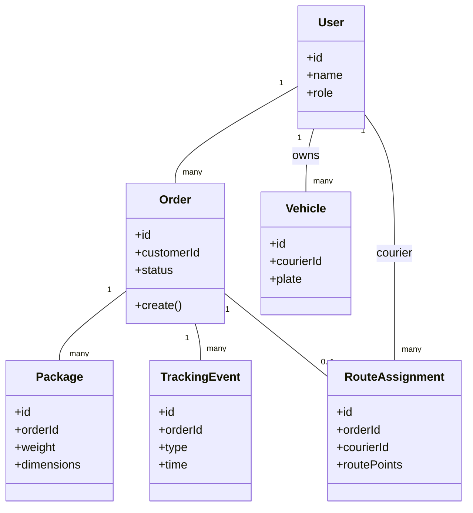

# Phân tích hệ thống quản lý giao nhận cho doanh nghiệp logistic

## 1. Actors và chức năng

- Khách hàng: Tạo đơn hàng, theo dõi trạng thái, yêu cầu hỗ trợ, cập nhật địa chỉ giao.
- Nhân viên vận chuyển: Nhận phân công, cập nhật trạng thái (Đã lấy, Đang giao, Giao thành công / Thất bại), báo sự cố.
- Bộ phận điều phối (Dispatcher): Gán tuyến, tối ưu lộ trình, xử lý đơn chậm.
- Quản lý (Manager): Xem báo cáo hiệu suất theo khu vực, tỷ lệ giao đúng hạn, tồn đọng.
- CEO: Dashboard tổng quan giao dịch, doanh thu, vùng hoạt động, KPI thời gian giao.
- Hệ thống tích hợp (External Services): Map API (định vị), Payment Gateway, Notification Service.

## 2. Phân loại chức năng theo loại hệ thống thông tin

- TPS (Transaction Processing System): Tạo đơn hàng, cập nhật trạng thái, ghi nhận giao thành công / thất bại, xử lý thanh toán.
- MIS (Management Information System): Báo cáo hiệu suất theo khu vực, tỷ lệ giao đúng hạn theo tuần/tháng, danh sách đơn tồn.
- DSS (Decision Support System): Gợi ý tối ưu tuyến giao, phân tích tải khu vực để điều phối nhân lực, dự báo nhu cầu mùa cao điểm.
- EIS (Executive Information System): Dashboard CEO (doanh thu tổng, số đơn/ngày, bản đồ vùng hoạt động, tỷ lệ đúng hạn, cảnh báo khu vực trễ).

## 3. Mô hình phát triển phần mềm đề xuất

Chọn: Agile (Scrum + Incremental Microservices).
Lý do: Yêu cầu thay đổi theo vận hành thực tế; cần phát hành nhanh các module (Tracking, Routing, Reporting). Cho phép phản hồi sớm từ vận chuyển và quản lý. Rủi ro tối ưu tuyến và hiệu năng có thể xử lý bằng iteration riêng. Dễ mở rộng thêm phân tích nâng cao (DSS) sau khi TPS ổn định.

## 4. UML đề xuất (4 sơ đồ)

1. Use Case Diagram: Xác định phạm vi chức năng và tác nhân (Customer, Courier, Dispatcher, Manager, CEO).
2. Activity Diagram: Luồng vòng đời đơn hàng (Tạo → Phân tuyến → Vận chuyển → Giao / Hoàn / Thất bại → Kết thúc).
3. Sequence Diagram: Tương tác cập nhật trạng thái giao hàng (Courier app → API → Tracking Service → Notification).
4. Class Diagram: Cấu trúc thực thể lõi (Order, Package, RouteAssignment, TrackingEvent, User, Vehicle).

## 5. Use Case (rút gọn)

## 6. Activity (Vòng đời đơn hàng)

## 7. Sequence (Cập nhật trạng thái giao hàng)

## 8. Class Diagram (rút gọn)

## 9. Ưu tiên triển khai (Roadmap ngắn)

1. Sprint 1–2: TPS nền tảng (Order creation, Status update, Basic tracking).
2. Sprint 3–4: Báo cáo MIS (bảng theo khu vực, tồn đọng).
3. Sprint 5+: Dashboard EIS + cảnh báo.
4. Sprint tiếp: Module DSS tối ưu tuyến (thu thập dữ liệu trước).

## 10. Tóm tắt

- TPS: Tạo/cập nhật đơn.
- MIS: Hiệu suất khu vực.
- DSS: Tối ưu tuyến, dự báo tải.
- EIS: Tổng quan chiến lược CEO.
- Mô hình: Agile cho thích ứng nhanh.
- UML: Use Case, Activity, Sequence, Class phục vụ phân tích toàn diện.
