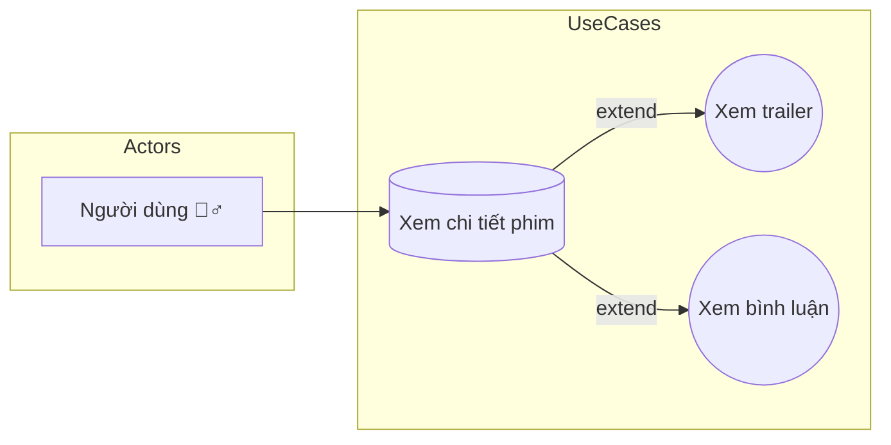

# 🎬 Use Case – Ứng dụng xem phim

## 🧍‍♂️ Actor

- **Người dùng**: Người xem sử dụng ứng dụng để tìm, xem thông tin và nội dung phim.

## ⚙️ Use Cases chính & mối quan hệ

| Use Case chính    | Use Case mở rộng | Mối quan hệ | Ý nghĩa ngắn gọn                               |
| ----------------- | ---------------- | ----------- | ---------------------------------------------- |
| Xem chi tiết phim | Xem trailer      | <<extend>>  | Mở trailer từ trang chi tiết phim              |
| Xem chi tiết phim | Xem bình luận    | <<extend>>  | Hiển thị bình luận/đánh giá liên quan đến phim |

## 📊 Sơ đồ Use Case (Mermaid)

## 🔍 Mô tả ngắn gọn

1. Người dùng truy cập trang chi tiết phim để xem thông tin (mô tả, diễn viên, thể loại, rating).
2. Từ trang chi tiết, người dùng có thể mở rộng xem Trailer hoặc xem phần Bình luận — đây là các chức năng bổ trợ (không bắt buộc) nên mô hình hoá bằng quan hệ <<extend>>.
3. Lưu ý triển khai: phần Trailer là nội dung media (cần CDN/streaming), phần Bình luận yêu cầu pagination và tính năng lọc/ẩn nội dung vi phạm.

---
