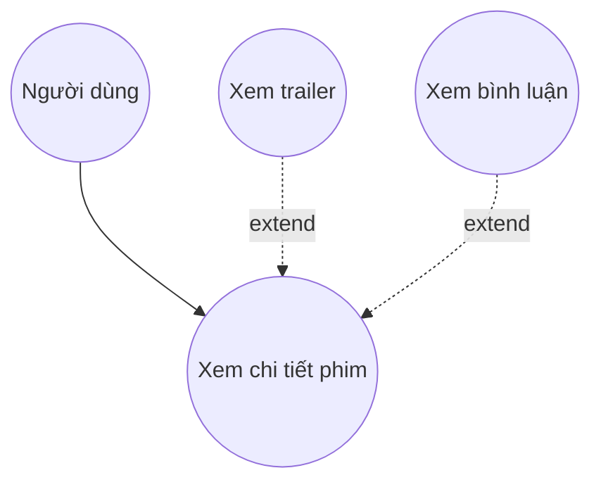

# 🎬 Use Case – Ứng dụng xem phim (Phiên bản tương thích)

## 🧍‍♂️ Actor

- **Người dùng**: Người xem sử dụng ứng dụng để tìm, xem thông tin và nội dung phim.

## 📊 Sơ đồ Use Case (chuẩn UML)

@startuml
left to right direction
skinparam packageStyle rectangle
actor customer
actor clerk
rectangle checkout {
customer -- (checkout)
(checkout) .> (payment) : include
(help) .> (checkout) : extends
(checkout) -- clerk
}
@enduml
